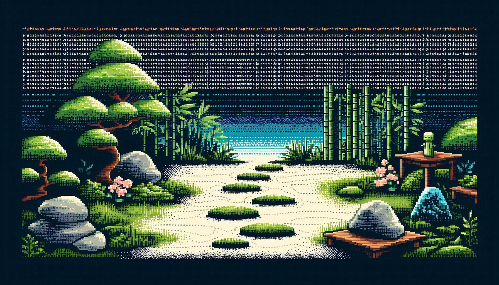

<p align="center">
  
</p>


# Terminal Zen Garden

Welcome to Terminal Zen Garden — a peaceful, interactive Zen garden for your terminal.  
No coding experience required. Just run, relax, and create.


---

## What is this?

Terminal Zen Garden is a Python-based interactive Zen garden you can design and explore entirely in your terminal.  
Move your rake, place stones, and load different garden templates — all using ASCII art.


---
## Why I make this project?

I created Terminal Zen Garden to introduce more people to the calming practice of Zen gardening. This terminal app offers a similar experience to a physical Zen Garden, but without the need for any tools or materials except for a device.

---
## How to Run

Follow these steps in your terminal:

### 1. Install Python 3.8 or higher

Download and install Python from the official site:  
https://www.python.org/downloads/

Make sure `python` and `pip` are available in your terminal:

```bash
python --version
pip --version
```

If not, restart your terminal or add Python to PATH during installation.

---

### 2. Install Required Python Packages

Open your terminal and run:

```bash
pip install textual rich
```

---

### 3. Download the Project

#### Option A: Download as ZIP

1. Visit the GitHub repo (replace this with your actual URL):  
   https://github.com/yourusername/terminal-zengarden

2. Click **"Code" > "Download ZIP"**

3. Extract the ZIP, then open the folder in your terminal:

```bash
cd path/to/terminal-zengarden/garden
```

#### Option B: Clone via Git (Recommended)

```bash
git clone https://github.com/Rainier-PS/terminal-zengarden.git
cd terminal-zengarden/garden
```

---

### 4. Run the Zen Garden

```bash
python main.py
```

✅ That’s it!  
Enjoy your peaceful terminal zen experience!

---

## Controls

| Key                | Action                                               |
|--------------------|------------------------------------------------------|
| ← ↑ ↓ →            | Move your rake                                       |
| Space              | Place a Large Stone (O, @, #)                        |
| S                  | Place a Small Pebble (o)                             |
| F                  | Place a Sakura Blossom (*)                           |
| R                  | Rake sand (~) or water (≈), or smooth it back        |
| W                  | Add Still Water (W)                                  |
| I                  | Plant a Reed/Iris (I)                                |
| C                  | Clear a tile (return it to sand)                     |
| D                  | Toggle Drag Rake Mode                                |
| 0-9                | Switch garden templates                              |
| N / P              | Next / Previous garden template                      |
| X                  | Random garden template                               |
| H                  | Show/hide help panel                                 |
| M                  | Show/hide map list overlay                           |
| Q                  | Quit                                                 |
| Ctrl+Z / Ctrl+Y    | Undo / Redo                                          |
| Ctrl+S / Ctrl+O    | Save / Load your garden                              |
| Ctrl+X             | Reset current garden template                        |

---

## Features

- Multiple themed templates: sand, stone paths, bonsai, temples, bridges, and more
- Interactive garden drawing with keyboard
- Save/load and undo/redo support
- Built-in help panel and visual legend
- ASCII bonsai intro art
- Beginner-friendly code for remixing

---

## Why Try It?

Zen gardens are a relaxing blend of art and minimalism.  
This project brings that feeling to your terminal. Whether you want to pause, play, or just explore some creativity—Terminal Zen Garden is your space.

---

## Remix & Share

- Add your own templates or tile types
- Share screenshots or fork the project
- Clean codebase, ideal for beginners

---

Created by Rainier-PS  
